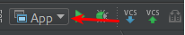
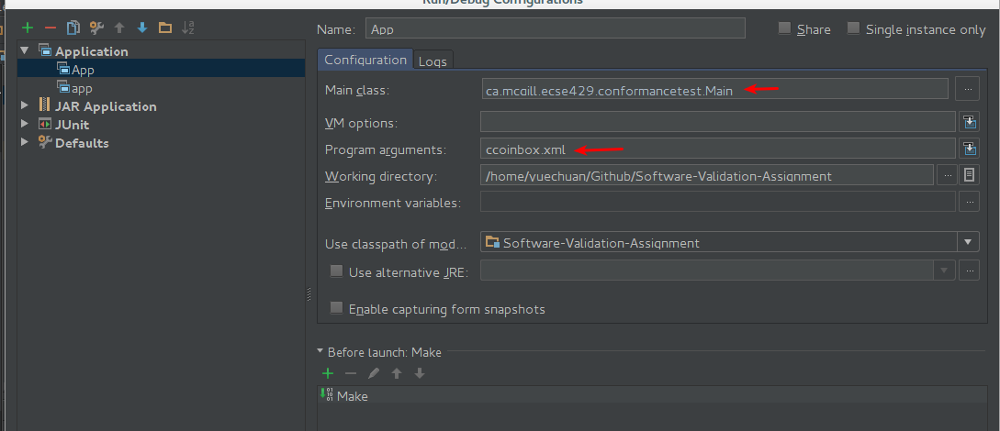

ECSE 429 Software Validation Assignment
====

Course: ECSE 429
Term: Fall 2015
Group: 14
Team Members: Sapon-Cousineau, Aleksi; Chen, Yuechuan

-----
## How the generator works
Generating the test cases is done in two main steps: creating the round-trip path tree and generating a list of java statements to use a the test method body.

### Generating the round-trip path tree
We first create an empty set for visited states. Beginning with the starting state declared by the machine, we create a new node. Next we get all transitions from this state. For every transition, we check if the resulting state is in the visited set. If so, we add the transition as a child to our node. If not, we add it to the visited set and create a new intermediate child for the transition, also generating its children recursively. Every step of recursion gets a copy of the set of visited states to ensure paths through siblings are ignored.

### Generating the java statements
Handling source code as strings is cumbersome and very limiting. Since Java has a formal grammar, we can instead use an abstract syntax tree, where each element is represented as nested objects. The javaparser library can parse java code, traverse and modify ASTs and print out nicely formatted code. The previously generated tree gives us a sequence of events with every path from the root to a leaf that can be converted to method calls on a `machine` instance. The only exception is the `@ctor` event, which needs to be converted to a constructor call and declaration of the variable `machine`. Example for CCoinBox:

```java
final CCoinBox machine = new CCoinBox();
machine.addQtr();
machine.addQtr();
machine.vend();
```

Next we need to handle meeting conditions for events. Here `vend` requires that `curQrts==2`. We can parse the condition string from the model file to an AST. Since we're outside the class, we first convert variables to getter calls on the machine instance. Next we assume some unknown event needs to be repeated until the condition becomes true. Since we can't deduce this event easily, we'll replace it with throwing an exception, so the code can't be used until manually fixed. This repetition entails a `while` loop until the condition is no longer false. We invert the condition logic and use it for our loop condition:

```java
while (machine.getCurQtrs() != 2) {
    throw new UnsupportedOperationException("Manually add code here for reaching condition: curQtrs == 2");
}
machine.vend();
```

Since the expected resulting state from an event is given to us, we can easily generate an assert statement to check the validity. The APIs for the implementations have a `getState()` method we can use to obtain the result state. They also contain an enum called `State` that lists all possibilities, with the same name as in the model file. We can use this to obtain the value of the expected state:

```java
machine.vend();
Assert.assertEquals(CCoinBox.State.empty, machine.getState());
```

Finally, we'll verify the result of the actions. This is the most complicated part, and is only doable because we can observe that most follow either the form `newValue = K` or `newValue = f(oldValue)`. For both forms, we begin the same way: parse the string to an AST and modify it to replace variables by getter calls on `machine`. The first form is simple: we generate an assert with the expected value of `K` and the actual value from the getter. For actions `curQtrs=0` and `allowVend=false`, we generate:

```java
machine.vend();
Assert.assertEquals(0, machine.getCurQtrs());
Assert.assertEquals(false, machine.getAllowVend());
```
The second form requires us to generate a variable declaration to store the old value, before the event call. The AST is then modified so that the function uses this value for the input. We generate the assert the same way as the first form to obtain:

```java
final int totalQtrs = machine.getTotalQtrs();
machine.vend();
Assert.assertEquals(totalQtrs + 2, machine.getTotalQtrs());
```

All together, for the last event of the example, we generated:

```java
// vend [curQtrs == 2] / totalQtrs = totalQtrs + 2; curQtrs = 0; allowVend = false; -> empty
while (machine.getCurQtrs() != 2) {
    throw new UnsupportedOperationException("Manually add code here for reaching condition: curQtrs == 2");
}
final int totalQtrs = machine.getTotalQtrs();
machine.vend();
Assert.assertEquals(CCoinBox.State.empty, machine.getState());
Assert.assertEquals(totalQtrs + 2, machine.getTotalQtrs());
Assert.assertEquals(0, machine.getCurQtrs());
Assert.assertEquals(false, machine.getAllowVend());
```

The comment was simply created from the transition information.

## Running the source
Download the zipped assignment and unzip to a directory.  
To generate tests for class not in the project, add the source into the `src` folder in the same package as described by the model file.  
Follow the instructions for the desired method.

### Method 1: Script
1. Open a terminal and change the directory to the project root.
2. Run `./run.sh (args)`. `chmod +x run.sh` might be needed to make it executable. See the section bellow for program arguments.

### Method 2: IDEA
2. Open IntelliJ IDEA.
3. In menu: select the option `New` --> `Project from existing source...`.
4. In the project import dialog, navigate to the project directory and select `Software-Validation-Assignment.iml`.
5.  Once the project is imported into the IDE, Click the dropdown menu on the toolbar and select `Edit configurations`.
6.  Make sure the main class is selected to `ca.mcgill.ecse429.conformancetest.Main`. See the section bellow for program arguments.
7. Give a name to the configuration and `save`.
8.   Press the green triangle to run.

### Arguments
To generate a test class, use the path to the XML model file. Relative paths are accepted. The generated class is placed in the package defined by the model. Example: `ccoinbox.xml`.  
To run a test class, use the `-r` switch followed by the fully qualified class name. Example: `-r ca.mcgill.ecse429.conformancetest.ccoinbox.TestCCoinBox`.

## State machine description
The state machine depends heavily on two other classes: `State` and `Transition`.

### Transition class
It is a composed of an `event` (eg. `vend`), a `condition` (eg. `curQrts==2`), one or more `action`s (eg. `curQtrs+=1`) and two states: `from` (the state transferring from) and `to` (the state transferring to).

### State class
It is simple container class for the name of the state.

### StateMachine class
It contains a list of all valid `State`s as well as a list of all valid `Transition`s. It also contains attributes such as the initial state and the class and package names.

This simple state machine covers all transitional behaviors of simple implementations, such as `CCoinbox` and `Legislation`, and is specific enough for (mostly) hands free code generation.

## Manual changes
Although the code generated is pretty solid, we still need to make a few alterations.
Inside the method bodies of `conformanceTest[7..9]` in the GeneratedTestCCoinBox class, we have to throw an `UnsupportedOperationExcaption` to indicate that the generated tests are incomplete and needed manual fixing. This is because our generator cannot necessarily deduce from the state machine diagram the events required to meet a condition. This would require complex analysis of the action code, to determine how events change the state machine values.

For example, in `conformanceTest9` we are able to test the condition  `curQtrs==3`, but we do not know how to bring the `curQtrs` value to 3. Hence, human intervention is necessary:

```java
// generated
while (machine.getCurQtrs() <= 3) {
    throw new UnsupportedOperationException("Manually add code here for reaching condition: curQtrs > 3");
}

// fixed
while (machine.getCurQtrs() <= 3) {
    machine.addQtr();
}
```

## Defects of the CCoinBox implementation
1. `allowVend` is never set to false in `CCoinBox.returnQtrs()`. This is solved by calling `setAllowVend(false)`.
2. `CCoinBox.reset()` never resets `allowVend` to false. This is solved by adding `setAllowVend(false)` before the return statement.
3. The logic in `CCoinBox.addQtr()` is incorrect, the state can be corrupted by calling this method. This is solved by rewriting the method like so:

```java
 public boolean addQtr() {
    boolean wasEventProcessed = false;

    curQtrs += 1;

    if (curQtrs >= 2) {
        setState(State.allowed);
        setAllowVend(true);
    } else {
        setState(State.notAllowed);
        setAllowVend(false);
    }
    wasEventProcessed = true;

    return wasEventProcessed;
}
```

## Main challenges to automate sneak path generation
Generating JUnit test cases requires us to know the expected results of a particular test. However this is not the case for a state machine such as defined in fig. 1. The expected error results (error messages and thrown exceptions) are not defined explicitly when we create a sneak path test hence we will still need to manually define (in advance) each of the acceptable outcome from the sneak path test case in order for us to generate test cases.
